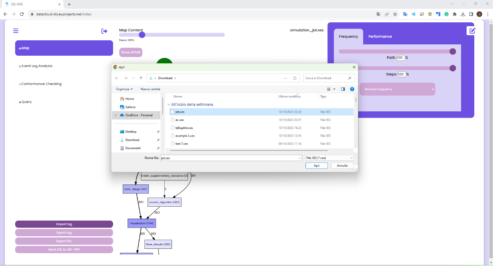

###############################################################
Integration & Toolbox Components
###############################################################

Here you can find instructions for the installation of PUZZLE Platform. 
This page references the repository under https://gitlab.com/puzzle-project/platform-setup

==========
Pipeline Discovery
==========
DIS-PIPE provides scalable integration of process mining techniques and Artificial Intelligence (AI) algorithms to learn pipelines’ structure by extracting, processing and interpreting vast amounts of event data collected from several heterogeneous data sources. Furthermore, DIS‑PIPE includes a graphical interface that supports various analytics techniques for visualising the discovered pipelines together with detailed diagnostics information about their execution, and a public API that enables external user interaction, including integration with DEF-PIPE. 

DIS-PIPE imports an event log in the XES format, containing traces associated with one or more pipeline executions. DIS-PIPE uses this event log to feed the preprocessing and discovery components for learning the pipeline models underlying the behaviours observed in the log. The importLog function can be invoked by clicking a dedicated button in the Map view of the GUI 

DIS-PIPE Features
------------
Integration with the Toolbox Components
------------
Deployment, Code and Documentation Availability
------------

==========
Pipeline Definition
==========

DEF-PIPE Features
------------
Integration with the Toolbox Components
------------
Deployment, Code and Documentation Availability
------------

==========
Pipeline Simulation
==========
SIM-PIPE Features
------------
Integration with the Toolbox Components
------------
Deployment, Code and Documentation Availability
------------

==========
Pipeline Scheduling and Adaptation
==========

ADA-PIPE Features
------------
ADA-PIPE Architecture
------------
Integration with the Toolbox Components
------------
Deployment, Code and Documentation Availability

==========
Decentralized Resource Marketplace (R-MARKET)
==========

R-MARKET Features
------------
Integration with the Toolbox Components
------------
Deployment, Code and Documentation Availability

==========
Pipeline Deployment & Management
==========

DEP-PIPE Features
------------
Integration with the Toolbox Components
------------
Deployment, Code and Documentation Availability

==========
Runtime Dashboard and Common DataCLoud UI
==========

Common Identity Management
------------
.. Puzzle components can be installed in a single VM with the following requirements.

.. +-------------------+------------------+-----------------+
.. | **CPU(cores)**    | **#Memory(GB)**  | **Storage(GB)** |
.. +===================+==================+=================+
.. |         4         |        16        |        40       |
.. +-------------------+------------------+-----------------+

.. Prerequisites
.. ------------

.. 1. **Docker Engine**: Version: 20.10.17+
.. 2. **Docker-Compose**: Version: 1.29.2+

.. Kafka configuration
.. ------------

.. 1. Go to kafka-cluster folder under the `repository <https://gitlab.com/puzzle-project/platform-setup>`_ and edit .env file.
.. 2. Change **<YOUR_SERVER_IP>** with the value of the server IP
.. 3. Change **<YOUR_SERVER_PUBLIC_IP>** (if it is NOT different from the server IP add server IP from the previous step).

.. Puzzle core configuration
.. ------------

.. 1. Go to puzzle folder under the `repository <https://gitlab.com/puzzle-project/platform-setup>`_ and edit .env file.
.. 2. Change <YOUR_SERVER> with the value of the server IP.
.. 3. Change <YOUR_DOMAIN> if you have a domain to expose the Dashboard component, else put the server IP.
.. 4. Change <KAFKA_HOST> with kafka IP from kafka configuration step
.. 5. Change all <YOUR_USERNAME> fields with the desired username
.. 6. Change all <YOUR_PASSWORD> fields with the desired password
.. 7. Change all <YOUR_KEY> fields with the desired key

.. Dashboard
.. ------------

.. .. TODO AYTO TO DIR DEN YPARXEI
.. 1. Go to dashboard folder under the `repository <https://gitlab.com/puzzle-project/platform-setup>`_ and edit .env file.
.. 2. Change **<YOUR_SERVER_IP>** with the value of the server IP.

.. Docker login
.. ------------

.. .. TODO UBI MEMBERS?
.. Some docker images are hosted in a private repo. So, before setup you need to login to the private repository. For the login credentials contact Alexandros Vasileiou at *avasileiou@ubitech.eu* or PUZZLE consortium at *office@puzzle-h2020.com*.

.. .. code-block:: console

.. 	docker login registry.ubitech.eu -u <username> -p <password>

.. ==========
.. Setup
.. ==========
.. Go to scripts folder under the `repository <https://gitlab.com/puzzle-project/platform-setup>`_ and give executable rights to **all** the scripts, by executing the script: 

.. .. code-block:: console

.. 	sudo ./init.sh

.. Start Puzzle
.. ------------

.. .. code-block:: console

.. 	./create-whole-stack.sh

 
.. Stop Puzzle
.. ------------

.. .. code-block:: console

.. 	./drop-whole-stack.sh

.. ***Additionally, for debugging reasons, there are scripts for each individual component as per the below image.***

.. .. image:: assets/setup_scripts.png

.. ==========
.. Kubernetes Cluster
.. ==========

.. Puzzle needs the user's applications to be deployed in a **kubernetes** cluster. The requirements of the kubernetes cluster are the following:

.. .. code-block:: console

.. 	Kubernetes version: 1.21
.. 	CNI: Cilium
.. 	Master Hardware:
.. 		CPU: 4cores
.. 		MEMORY: 8GB
.. 	OS: Linux with kernel >= 5.0.0

.. Puzzle Config for Kubernetes
.. ------------

.. In order for Puzzle components to communicate with the *kubernetes cluster*, the **Security Orchestator (SO)** component exposes a REST API.

.. Add kubernetes credentials
.. ------------

.. You need to provide the contents of the ***.kube/config*** file of kubernetes.

.. .. code-block:: console

.. 	METHOD: POST
.. 	#Change <serverIP>
.. 	URL: http://<serverIP>:8300/api/v1/kubernetes/config
.. 	#Update with the corresponding values  
.. 	JSON File:
.. 	{
.. 		"masterUrl": "<masterUrl>",
.. 		"clientCertData": "<clientCertData>",
.. 		"clientKeyData": "<clientKeyData>",
.. 		"caCertData": "<caCertData>"
.. 	}

.. Check communication with kubernetes
.. ------------

.. It responds with *SUCCESS* if the configuration was successful else it responds with *FAIL*.

.. .. code-block:: console

.. 	METHOD: GET
.. 	#Change <serverIP>
.. 	URL: http://<serverIP>:8300/api/v1/kubernetes/checkConfig

.. Fetch kubernetes credentials
.. ------------

.. It returns the kubernetes credentials with an *id*. You need that *id* in case that you want to delete the credentials.

.. .. code-block:: console

.. 	METHOD: GET
.. 	#Change <serverIP>
.. 	URL: http://<serverIP>:8300/api/v1/kubernetes/fetchAll

.. Delete kubernetes credentials
.. ------------

.. You need the *id* of the stored credentials.

.. .. code-block:: console

.. 	METHOD: DELETE
.. 	#Change <serverIP> and <id>
.. 	URL: http://<serverIP>:8300/api/v1/kubernetes/delete/id/<id>

.. ==========
.. Node Level Agent
.. ==========

.. You need to add **Node Level Agent (NLA)** to all the **worker nodes** of the kubernetes cluster. For the time being the installation of NLA is a manual procedure.

.. Download NLA
.. ------------

.. .. code-block:: console

.. 	wget --header "DEPLOY-TOKEN: PppkJjU-SEUH4skR9Pks" https://gitlab.com/api/v4/projects/33843622/packages/generic/puzzle-nla/1.0.0/puzzle-nla 

.. Run nla
.. ------------

.. NLA is a binary executable that accepts REST calls at port *65103*. After you give executable rights, you can run NLA as a background process.

.. .. code-block:: console

.. 	sudo nohup ./puzzle-nla &

.. ***For the time being NLA supports Ubuntu, Debian and Centos distributions***

