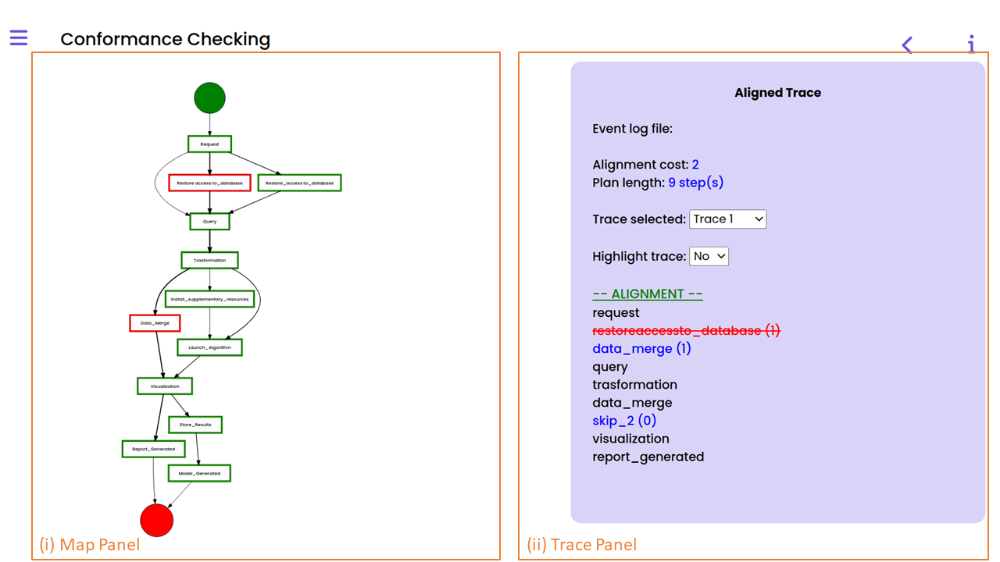
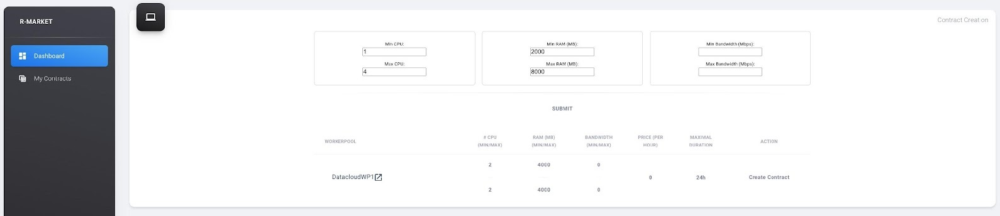
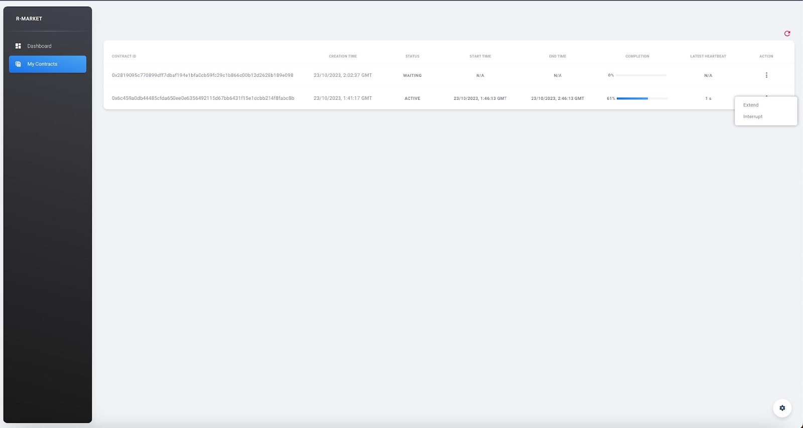
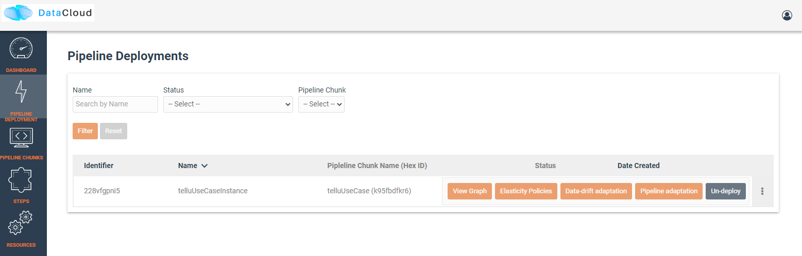
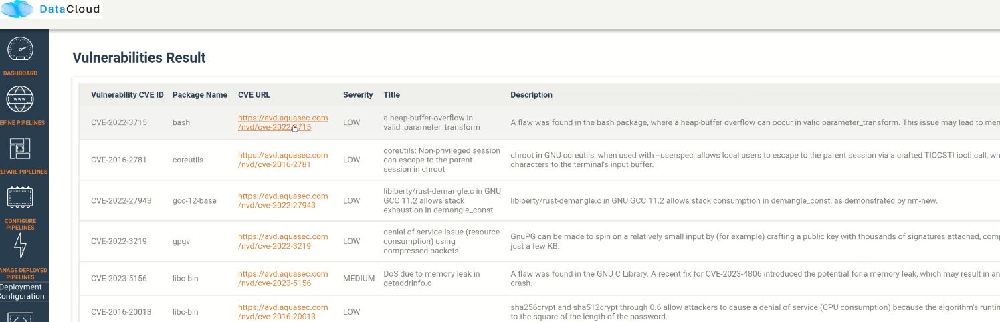

###############################################################
How to use DataCloud
###############################################################

Landing in the Toolbox
=====

The datacloud toolbox landing page contains a short introduction along with a reference guide to the current documentation page.

.. image:: assets/toolboxLandingNew.png

It also provides a brief overview of the project's tools along with external links.

.. image:: assets/toolboxLandingOverviewTools.png

The toolbox page can be used for centralized login to datacloud tools and new user registration. 

.. image:: assets/toolboxRegister.png

As for most tools Keycloak has been integrated, user should login with appropriate credentials in order to access tools such as DEF-PIPE and SIM-PIPE. 

Design Tools
=====

This section introduces users to the utilization of DataCloud for constructing pipelines. It outlines how to employ the DataCloud DSL and graphical tools for design purposes, as well as methods for uncovering new pipelines from logs. Additionally, it covers the simulation of these pipelines before their actual deployment.

Pipeline Discovery
-------

The DataCloud pipeline lifecycle commences with the pipeline discovery step. This page provides an overview of the steps needed to run DIS-PIPE and use its graphical user interface (GUI).

.. image:: assets/disPIPEmainpage.png

When a data scientist is interested in analyzing the behaviour of the data pipeline, can import an event log in XES from the I/O Options panel in DIS-PIPE, as shown below, at the bottom-left part of the GUI in, box (vi).

Once an event log is imported, DIS-PIPE automatically runs the implemented discovery algorithm and produces an understandable flowchart view of the discovered pipeline in the form of a DFG, which is visualized in the Map View, cf. the central part of the GUI in the above page, box (ii). The name of the log file from which the pipeline model is extracted is shown in the top part of the GUI in box (i). 

In the case that the data scientist plans to obtain more targeted information on the frequency or performance values related to a node/edge of the DFG, she can directly click on the specific node/edge of interest. A pop-up appears in the GUI showing the requested information. For instance, data regarding the frequency values of the "Data Merge" step are displayed in the image below.

Suppose now that the data scientist is interested in gathering further insights about the performance of each step of the pipeline under investigation. To this aim, she clicks on the Performance Tab in the tab switcher called “Pipeline Map Visualization Options”, cf. the top-right part of the GUI in the next page.

The user can use the Metric Switcher (see image below, box (iii)) to select the option "mean duration," which updates the pipeline model with the requested information, as shown in the DFG of the image below, in order to investigate whether the mean duration of each step is aligned with the expectations.

Suppose a data scientist aims to visualize a version of the DFG that exclusively encompasses the pipeline execution paths without requiring database access restoration. To accomplish this, the data scientist needs to transition from the "Map view" to the "Event Log Analysis View," as shown below.

As a result, the anatomy of the event log (i.e., the execution variants and the specific traces) will be visualized on the GUI. Then, to filter out the “restore access to database” steps from the analysis, the data scientist can select the “Attribute” filter from the “Filters” panel, as depicted below. 

To activate the "forbidden mode" for the "restore access to database" steps, a pop-up will appear on the GUI; refer to the image above for more information. Upon selecting the "Apply" button, the event log will become opaque to all execution traces, excluding one of these steps. This allows the pipeline model to be updated by the discovery algorithm, omitting the "restore access to database" steps.

When the application of the filtering is completed, the data scientist can look at the statistics associated to the filtering activities enacted up to that moment. 

.. _conformance checking:

Conformance Checking
~~~~

Lastly, the data scientist might be curious to verify if an event log and a pipeline model that was found from another event log or modeled using DEF-PIPE are consistent. She initiates the process by selecting "Conformance Checking" from the View Switcher. This will prompt her to select a pipeline and a log file, which may come from a different process for which she has the DSL or from the outcome of the process discovery she completed earlier. Once the input has been selected, the user is presented with a menu where they must match the steps from the selected model on the right side with the steps from the log on the left.

When mapping is finished, the user can click the “Next” button to go to the next menu, in which customization of the alignment in the “Alignment Configuration Panel” and look at details about the chosen log in the “Log Details Panel” can be performed.

Upon completion of the configuration, the user can move forward by selecting the "Next" button. This will display the pipeline map in the "Map Panel," with each step indicated in either green (indicating no misalignments during the conformance checking) or red (indicating some misalignments discovered). By setting "Highlight Trace" to "Yes," the user can highlight the selected trace in yellow and view alignment details for each individual trace of the selected log in the "Trace Panel." The user can view the number of times a step in the pipeline map caused a misalignment as well as a list of the traces where that occurred by clicking on the step's box. Below is an screenshot of an interface that displays the results of conformance checking.

Pipeline Design 
-------

When accessing DEF-PIPE, in the upper-right corner, the” Login” button allows the user to login with the DataCloud Keycloak credentials, unless the user is already logged in.

The left panel contains lists of steps and pipelines. An open padlock-icon near the steps and pipelines names means that the corresponding description is public (closed padlock means private).

On the right side of the upper menu line there two are options: “Workflow Designer” and “Step Designer”. They correspond to two regimes of work: creation/editing workflow /pipeline and creation /editing Steps.

DEF-PIPE consists of two main sections, each serving a crucial role in the pipeline design process:

1. **Step Designer:** Users have the capability to design individual pipeline steps, each customizable with specific parameters and details like name, category, requirements, and visual appearance. These steps will serve as the functional units in the overall data processing workflow. 
To access the step designer, click on the icon on the top right side of the tool

  .. image:: assets/defPIPEstepDesigner.png

2. **Workflow Designer:** The Workflow Designer is where you can create your data pipelines by connecting steps previously designed in the step designer. This visual part allows you to orchestrate the data flow by specifying how data moves from one step to another.
  .. image:: assets/workflowDesignerDEFpipe.png

When selecting “Step Designer” option, new steps can be created after selection of “Add step” in the left panel. Otherwise, clicking on existent Steps, open it in the main (grid) part of the window.

  .. image:: assets/stepDeisignerDEFpipe.png

When working with Steps right panel provides options: Information, Parameters and Connections.

a. **“Information”** allows add steps name and shape
#. **“Connection”** allows add inputs and outputs of the Step. Coordinates and types of the connections are entered in the corresponding boxes.
#. **“Parameters”** allow add Step parameters according to DSL description.
#. **"Save and Delete"** buttons to save or delete the step

The available steps for working with Workflow/pipelines (also known as the "Workflow Designer" menu) are listed in the left panel. The corresponding step is drawn in the window's main section upon clicking on it.

  .. image:: assets/workflowDesignerDEFpipe2.png

Connections between steps are drawn after clicking on the corresponding connection points. It has to be noted that all Workflows/pipelines must have Start and End points (taken from the list of steps). If they are not present, then the generation of DSL is not possible.

Parameters of the pipelines can be described (or visualized) in the right panel. 

The `“Save”` button in the upper menu line allows to save the created pipeline. “Export DSL” button in the upper line menu allows to generated corresponding DSL text from the current graphical pipeline description, while “Export JSON” allows to export a json representation of the pipeline and its graph.

Step-by-Step Guide: Creating Steps and Building a Data Pipeline
~~~~~

Here is provided a step-by-step approach to creating three steps in the Step Designer, specifying their parameters, and subsequently using the Workflow Designer to construct the pipeline.

Step 1: Designing Steps in the Step Designer
""""

1. **Accessing Step Designer:** Click the Step Designer icon on the top right side of the DEF-PIPE tool. This will navigate to the Step Designer interface.
2. **Step Creation:** In the Step Designer interface, you may create the step by clicking the “Add” button

  .. image:: assets/stepCreationInStepDesigner.png

3. **Naming your Step:** 
   Give the step a meaningful name. This name will help you identify and manage the step within your pipeline. 

   * Locating Step Properties: Once the step (new template) appears on the screen, on the right-hand side, you can observe a panel named “Step Properties”.

   * Configure Step Information: Under the “Information” tab within the “Step Properties” you can specify a name and category for your step. For instance, for the first step, we chose “1-retrieve” and save it under the category of desire.

  .. image:: assets/namingTheStepAndCategory.png

4. **Configure Step Parameters:** 
   In the "Step Properties" within the "Parameters" tab, you can fine-tune your step by configuring various parameters. This includes defining the step type, implementation (Image container), environment parameters, and execution requirements.

   * **Step Type and Image container:** For instance, in the "1-retrieve" step, you can set the step type as "data-source" and specify the image container as "demo/1-retrieve:1.0"
     
     .. image:: assets/parameterCOnfiguration.png

   * **Environment Variables:** To further customize the step, you can add environment variables like "MQTT_PORT" and "MQTT_CLIENT_ID" by clicking the "+" button under the "Env. Parameters" tab.
        
     .. image:: assets/enviParameters.png

   * **Execution Requirements:** To specify execution requirements, click the button to extend this part. You can then choose from various requirement types such as "image requirements," "OS requirements," "vertical scale," "horizontal scale," "network requirements," "qualitative requirements," "quantitative requirements," and "security requirements" to tailor the step to your specific needs. 
     
     .. image:: assets/execReqDEFpipe.png

5. **Save your Step:** Once all parameters are adjusted, it is time to save the step under a category. This ensures easy access and use it inside the Workflow Designer when building your data pipeline. To do this, click the "Save" button.

     .. image:: assets/saveTheStep.png

6. **Repeat for Two More Steps:** 
   Repeat the above steps to create two more essential steps for your data pipeline. Ensure you provide each step with a clear name, categorize them as needed, and configure them to match your specific requirements.

   For this guide, let's assume that these two new steps are named "2-process" and "3-notify" and are placed under the same category of " ICPM."

Step 2: Building a Pipeline in Workflow Designer
""""

After successfully creating and configuring your three steps in the Step Designer, save your progress and return to the main DEF-PIPE interface, the "Workflow Designer."

**Add Start and End point:** Creating a functional pipeline requires including both start and end points. The start point should be placed and connected before the first step in your pipeline. Similarly, the end point should be placed and connected after the last step in your pipeline. To do this, navigate to the "Standard steps" category within the Workflow Designer. You can find "Start" and "End" points specifically designed for these purposes here. Click on them to add these essential start and end points to the canvas model.

     .. image:: assets/startAndEndPoint.png

Conformance Checking of Designed Pipeline
~~~~~~

In addition to the steps for the discovery of a pipeline, DIS-PIPE can be used to convert a DSL pipeline imported from DEF-PIPE into a DFG model in DIS-PIPE, thus facilitating the execution of conformance-checking operations.

This is achievable through the "Get user workflow" feature of DIS-PIPE, though which we users can view a list of all the pipelines stored in the DEF-PIPE storage.

     .. image:: assets/disImportDSLfromDEF.png

Once the desired pipeline's name has been identified, it becomes possible to import it as a DSL and perform the conformance check though the trace alignment technique, as described already in section :ref:`conformance checking`

Pipeline Simulation
-------

SIM-PIPE software is installable and initiated utilising Python via the command line interface, designed with data engineers in mind, who typically possess the required proficiency to execute Python scripts in such an environment.

The SIM-PIPE graphical user interface, which allows users to manage projects, is seen in the image below.

     .. image:: assets/listOfProjects.png

When the user creates a new project, an Argo workflow template defining a data pipeline, should be provided. Below, is the the interface with a dialogue box displayed for the user when adding a new dry run for a given project. In the dialogue box, the user can provide input files for the Argo workflow data pipeline, depending on what input files are defined in the workflow template.

     .. image:: assets/addNewDryRun.png

This page also lists existing existing dry runs, and by clicking on a specific dry run, the user is redirected to a page which contains detailed information about that given dry run.

The pipeline's steps are shown in the diagram below, along with a list of the outputs from each step that can be viewed and downloaded (if any; outputs must be defined in the Argo workflow template). 

     .. image:: assets/diagramAndListOfPipelineStepsForDryRun.png

The figure below provides additional information about the same dry run, such as interactive plots for resource consumption metrics like CPU, memory, and network throughput, and a list of logs from each stage of the pipeline.

     .. image:: assets/logsFromDryRUnStepsAndInteractivePlots.png

The image registry key vault secrets are listed here. To use images from a specific image registry in the data pipeline, the user can add image registry secrets to this tab and link the secret to a project.       

     .. image:: assets/listOfImageRegistrySecrets.png

Pipeline Execution & Runtime Management
=====

This part of DataCloud is focusing on the deployment of the pipelines and can be used to support different set of users if needed (e.g., users in an organization that can only deploy a set of pre-designed pipelines, or users that don’t have access to event log files and DIS-PIPE). Deployment pipelines is performed after retrieving the designed pipelines from the DEF-PIPE. 

For providing a more integrated and easier to use platform, Runtime Dashboard that is a part of DEP-PIPE tool is used as a central access point and integrates at the frontend level with DEF-PIPE and the other design tools.

     .. image:: assets/designPipelinesRunetimeDashboard.png

In general, the following steps are followed to deploy a pipeline

- Select a pipeline designed in DEF-PIPE

- View or configure the pipeline prior deployment (e.g., change passwords used, define deployment needs, set ENVs)

- Deploy to the desired resources

- View and monitor the pipelines

In addition, users can:

- Setup and edit resources to be used 

- Increase the available cluster resources with workers from R-MARKET 

- Check for vulnerabilities in containers of the pipeline steps

- Set adaptation policies

Resource Management
-------

Regarding the execution and management of the pipeline at runtime, once the user logs in to the runtime dashboard that is provided by DEP-PIPE. This tool is actually the main point of interactions for both ADA-PIPE and R-MARKET.

     .. image:: assets/designPipelinesRuntimeDashboardNew.png

For the execution of the pipeline, an existing Kubernetes cluster must be provided.

     .. image:: assets/utilizingResourcedFromRmarketNew.png

Utilizing Resources from R-MARKET
-------

This section outlines the use of the R-MARKET tool for resource provisioning during pipeline execution. Users require a web browser, ideally Chrome, equipped with the MetaMask plugin to access the R-MARKET UI. Creating a MetaMask account is essential, as it functions as a wallet for interaction with the R-MARKET UI and the DataCloud blockchain. 

Access to the R-MARKET UI is available through the DataCloud Run-Time Bundle dashboard.

MetaMask Configuration
~~~~~~~

Resources ownership in the R-MARKET UI are handled through MetaMask, so users must own a MetaMask wallet. 

Specific configurations are required to connect to the project’s private blockchain. Users need to specify the following settings:

- **URL:** dcd-blockchain.westeurope.cloudapp.azure.com:8545

- **ChainID:** 65535

- **Token:** DCD

To utilize the R-MARKET-UI, users must first install MetaMask and configure it as shown on the left screen. Subsequently, they need to connect their MetaMask account to the R-MARKET-UI. A pop-up notification will appear when the web app is loaded or any button is clicked.

|pic1| |pic2|

R-MARKET Usage
~~~~

Usage of R-MARKET UI is divided into two main stages: (i) Creation of a reservation contract with a resource and (ii) the monitoring of the created contracts. These two steps are managed by two different tabs: (1) "Dashboard", which manages the discovery of resources as well as the creation of contracts and (ii) "My Contracts", which allows to list all the contracts created by the user in a table and retrieve their status (in progress, completed or failed) as well as other information. The following of this section explains how to use R-MARKET-UI to:

- Find resources available on the market

- Choose a particular resource and create a contract with it

- Monitor the contracts created with different resources

- Extend/interrupt the active contracts
The R-MARKET tool uses the blockchain technology to create contracts between workers (resources) and requesters (DataCloud users).

Adding Resources
~~~~

For finding resources that can be used for the deployment of the pipelines, user starts by providing requirements as shown in the example, and click on "Submit" to display the available resources in a table.

By selecting the link on the resource name to open the DataCloud WP1 description with its current resources in a new tab, while by selecting one of the available resources and clicking "Create contract" a prompt will appear asking to fill in the desired duration of the contract (we recommend at least an hour so that you have enough time to extend/interrupt the contract before it finishes).

Once you click on "Create Contract", MetaMask notifications will pop up asking you to sign transactions.

One last MetaMask notification will pop up asking you to sign a contract with the selected resource. Contract creation could take some time but an alert eventually pops up notifying you of the creation of the contract with its ID (which you can find in the "My Contracts" tab).

Contracts Monitoring
~~~~

Click on "My Contracts" to display the contracts of the user (selected in MetaMask). You can check your contracts info here. Note that you can also click on the refresh button on the top right corner of the table.
Select one of your contracts by clicking on the three vertical dots in the "Action" column and click on "extend", you should see a prompt appear asking you to fill an extension duration. Once you click on "Extend Contract", you should see an alert pop up after some time confirming the contract extension.

Select one of your contracts by clicking on the three vertical dots in the "Action" column and click on "interrupt", you should see a prompt appear asking you to confirm the contract interruption. Once you click on "Interrupt Contract", you should see an alert pop up after some time confirming the contract interruption.

Pipeline Deployment & Management
-------

Retrieving Pipeline
~~~~~~

For performing a deployment, DEP-PIPE is provided by DEF-PIPE a list of available pipelines of the user. If no pipelines are available (no deployable pipelines in DEF-PIPE for the user account) a message will be displayed. Users can visit DEF-PIPE and can create one pipeline or copy one of the available template pipelines available.

For performing the deployment, DEP-PIPE is provided by ADA-PIPE with the pipeline chunk to deploy in the specific resources selected by it.

Configuring Pipeline Deployment
~~~~~~~~

Once the pipeline has been analysed and chunks have been created, we can view them in the dashboard.

Users can view the pipeline steps of the pipeline and if they need to configure them prior to deployment.

Deploy Pipeline
~~~~~~~

Once the pipeline is configured, user can proceed with the deployment.

A successful deployment is then presented in the user dashboard.

Menu options provided for viewing the graph, editing policies and un-deploy the pipeline.

The pipeline graph and monitoring data are provided to the user.

Vulnerability Scanning
~~~~~~~

With DataCloud, data scientist and protect their pipeline deployments with multiple tools. In specific vulnerabilities scanning is available with a single click. The first step is to go to the dedicated page of DataCloud, view all containerized steps and select the option “Scan” to perform a new vulnerability scanning on the image. The process can take from few seconds to few minutes, depending on the complexity and the dependencies of the step. 

Once ready the user can press “View” to see the vulnerabilities of the specific step. Results are stored in the Runtime Dashboard database so they are easy and fast to retrieve by the DataCloud users.

A very important part of the process for protecting the components is to view details about a vulnerability and understand the dangers and the mitigation actions that can be followed to fix the issue. For this purpose, we provide links to an online vulnerability database, in specific the Aquasec Vulnerability Database (avd.aquasec.com).

