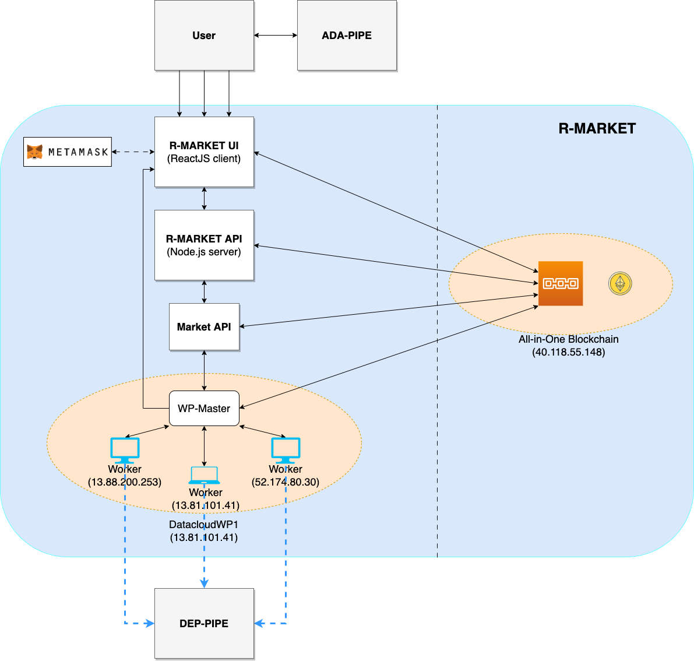
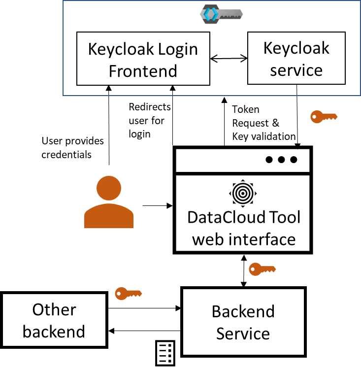

###############################################################
DataCloud Components & Functionalities
###############################################################

==========
Pipeline Discovery
==========
DIS-PIPE provides scalable integration of process mining techniques and Artificial Intelligence (AI) algorithms to learn pipelines’ structure by extracting, processing and interpreting vast amounts of event data collected from several heterogeneous data sources. Furthermore, DIS‑PIPE includes a graphical interface that supports various analytics techniques for visualising the discovered pipelines together with detailed diagnostics information about their execution, and a public API that enables external user interaction, including integration with DEF-PIPE. 

DIS-PIPE imports an event log in the XES format, containing traces associated with one or more pipeline executions. DIS-PIPE uses this event log to feed the preprocessing and discovery components for learning the pipeline models underlying the behaviours observed in the log. The importLog function can be invoked by clicking a dedicated button in the Map view of the GUI 

.. image:: assets/positionGUIimportLog.png

DIS-PIPE Features
------------

Below is the most recent overview of DIS-PIPE's features, which include Event Abstraction, Segmentation and Trace Preprocessing, Dark Data Discovery and Exploitation, and Interface Functions.

- **Event Data Analysis:** DIS-PIPE is able to analyse event data collected from various sources and related to a single (or multiple) data pipeline(s).
- **Interpretation of Partially Ordered Event Data:** DIS-PIPE interprets event data that are recorded in a partially ordered way, i.e., without explicit timestamp associated with them or with a timestamp having a coarse granularity (e.g., days).​
- **Low-frequency Trace Filtering:** DIS-PIPE is able to recognise traces of event data with a low execution frequency and filter out them from the subsequent analysis.
- **Rule Filter:** DIS-PIPE enable to specify complex rules in the form of ordering constraint between pipeline steps.
- **Event Logs Generation and Interpretation:** DIS-PIPE is able to produce and interpret event logs formatted in XES, MXML, or CSV​.
- **Big Data Pipeline Discovery:** DIS-PIPE is able to discover big data pipelines starting from event logs formatted in XES, MXML, or CSV
- **Pipeline Expressiveness:** DIS-PIPE is able to discover big data pipelines, including XOR, OR, AND, loops, and data association constructs.
- **Pipeline Visualisation and Description:** DIS-PIPE allows users to have a visualisation and a description of the running pipelines.
- **Pipeline Analytics:** DIS-PIPE computes analytics on the discovered pipelines.
- **Conformance Checking:** DIS-PIPE performs conformance checking on the discovered pipelines and those developed in the past.
- **Anomaly Detection:** DIS-PIPE interprets the compliance checking outcomes signalling nonconforming deviations and providing repair solutions
- **Interface Functions: **Development of the missing interface functions to import a DSL pipeline from DEF-PIPE and to export an event log in XES format.
- **Dark Data Discovery and Exploitation:** Development of a querying algorithm to extract information related to the dark data manipulated by the data pipeline.
- **Segmentation and Trace Preprocessing:** Implementing and testing of the algorithm that performs segmentation and trace preprocessing.
- **Event Abstraction:** Implementing and testing of the algorithm that performs event abstraction.

DIS-PIPE also is available on GitHub at the following link: https://github.com/DataCloud-project/DIS-PIPE

DIS-PIPE is deployed on a single host accessible from the browser at following link: https://195.231.61.196:7778/ (or at https://datacloud-dis.euprojects.net/). The user’s browser first triggers an incoming request. Afterward, the backend of the tool, which is in charge to load the GUI and allow users to interact with its provided functionalities, manages and processes the user’s request.

.. image:: assets/disPipeDeployment.png
==========
Pipeline Definition
==========

DEF-PIPE provides a visual design for domain experts to implement Big Data pipelines based on a DSL, including means to store and load the pipeline definitions. Furthermore, it enables data scientists to define the pipelines by configuring each step, injecting code, or customising predefined generic templates.

The DEF-PIPE Frontend is a graphic pipeline designer tool for defining Big Data pipelines and transforming them to DSL. The main part of the application is the interface for designing big data pipelines. This interface is implemented as a single page application using ReactJS. The popularity and stability of ReactJS make it potentially more friendly with developers to continue with the project later on. The project also uses Bootstrap, a CSS-framework providing basic UI-components building blocks, which are easy to customize.

The backend is implemented in C# using the DotNet (.NET) framework from Microsoft. In particular, ASP.NET Core, which is the part of the NET framework for web application, is being used. It implements a web API providing a central interface for operations such as managing pipelines and templates data, transforming pipelines into DSL.

Database of Pipeline Designer is used to model the steps and workflow of the pipeline. The model is persisted in JSON-format, and persisted in a MongoDB database. DEF-PIPE is integrated with Keycloak as single sign-on (SSO) solution. It offers user asset management for steps and pipelines, including the ability to expose them to other users publicly. The frontend includes improved support for parametrization of steps.

The architecture is displayed bellow.

    
#. **Schema editor** allows a graphical construction of the Big Data pipelines through drag-and-drop operations of the step descriptions stored in the template library.
#. **Templates editor** is a graphical component for describing pipeline steps through their parameters and resource requirements. A templates library stores the steps’ textual descriptions for subsequent pipeline design purposes.
#. **DSL editor** allows describing pipelines in a textual form. The templates library also stores the complete pipeline descriptions for further redesign and reuse.   
#. **Pipeline repository** stores Big Data pipelines using their DSL representation.
#. **Public API** enables external interaction, including integration with the DIS-PIPE, SIM‑PIPE and ADA-PIPE tools.

Regarding pipeline representation, the tooling provides various improvements of the domain-specific language (DSL), including a grammar for specifying DSL models and implementation of editors (autocomplete + validation) in the Eclipse environment

To start working with the DEF-PIPE graphical tool, use the following link: https://crowdserv.sys.kth.se

A quick start guide is available on GitHub: https://github.com/DataCloud-project/DEF-PIPE-Frontend

DEF-PIPE Features
------------

Below provided an overview of the features implemented and integrated with other tools:

- Provide user-based management of pipelines
- Support private and public pipelines
- Integration with IAM for single sign-on
- Improvements on the UI based on the feedback
- Integration with more stable orchestrations
- Integration with DEP-PIPE
- Integration with SIM-PIPE
- Integration with DIS-PIPE
- Integration with ADA-PIPE

------------

DEF-PIPE is available on GitHub, along with dedicated instructions for usage https://github.com/DataCloud-project/DEF-PIPE-Frontend

The DEF-PIPE graphical tool is also deployed at https://crowdserv.sys.kth.se

==========
Pipeline Simulation
==========

SIM-PIPE simulates the pipeline execution and provides final deployment configurations that conform to the hardware requirements. SIM-PIPE also provides testing functionalities, such as a sandbox for evaluating the performance of individual pipeline steps and statistical analysis of the overall pipeline performance.

SIM-PIPE takes a pipeline's definition as input and outputs runtime metrics, such as CPU usage, memory usage, energy consumption, run durations, and network bandwidth. SIM-PIPE can perform dry runs of pipelines by running small and brief versions of the pipelines in a sandbox. These dry runs improve the simulations' accuracy for deployments at larger scales and assert whether one pipeline executes successfully.

SIM-PIPE consists of the following components: a web graphical user interface, a controller with an API, a relational time-series database, a simulation engine, and a sandbox to execute the dry runs.

The key innovation implemented in SIM-PIPE leverages the container-based approach for data pipelines and is related to the following aspects:

- Novel means of leveraging container-based approach for data pipelines with sample data and different configurations to perform eventual simulations.
- A dry run approach for generating inputs for simulators.

The SIM-PIPE user interface is shown below. A dry run's pipeline steps are listed on the left screen, and logs from the run are displayed with interactive resource metrics plots on the right screen.

|pic1| |pic2|

.. |pic1| image:: assets/simPipeUI1.png
   :width: 49%

.. |pic2| image:: assets/simPipeUI2.png
   :width: 49%

SIM-PIPE Features
------------

SIM-PIPE provides the following high-level functionalities:

1. Deploying each step of a pipeline and running it in a sandbox by providing sample input. 
2. Evaluating pipeline’s step performance by recording and analysing metrics about its execution to identify bottlenecks and steps to be optimised. 
3. Identification of resource requirements for the pipeline by calculating step performance per resource used.
4. Proof of concept integration with KWOK1, which simulates a cluster of Kubernetes nodes, that allows testing your pipeline with different Kubernetes features, e.g., node types and capacities.

Below a summary of the features implemented and integrated with other tools.

- GraphQL API
- Authentication and authorisations
- Dry run execution
- Secure sandbox environment
- Metrics collection
- Integration of KWOK simulation engine

The SIM-PIPE source code is available in a single GitHub repository: https://github.com/DataCloud-project/SIM-PIPE 

It is released as open-source software under the Apache License 2.0.

The SIM-PIPE technical documentation, architecture description, deployment and installation guides, and user guides with examples, and contributing guide are also available in the GitHub repository. SIM-PIPE is used as a self-installed tool, that users can use. A public deployment is currently included as part of the DataCloud demo server (datacloud-toolbox.euprojects.net).

==========
Pipeline Scheduling and Adaptation
==========

ADA-PIPE provides a data-aware algorithm for optimised and adaptable scheduling on the Computing Continuum with infrastructure drift adaptation capability. ADA-PIPE allows to reconfigure the resource allocation to pipeline steps to fulfil the service level agreement between user’s and the resource providers. 

ADA-PIPE Features
------------

Here is an overview of the features implemented and integrated with other tools:

- Scheduling tool implementation for QoS Guarantee for Tasks with Strict Deadlines and Data-Aware Pipeline Scheduling
- Adaptation algorithm with support of Limited Dynamic Scheduling; Avoidance of Highly Utilized Resources;
- Adaptation policies, Scheduling and scaling up/down the data pipeline executions;
- Monitoring policies, Utilization of resources and pipeline chunks.

ADA-PIPE Architecture
------------

The schema below illustrates the ADA-PIPE tool components related to the monitoring, followed by data preprocessing. Afterward, ADA-PIPE (re-)trains a k-means model on the pre-processed data to detect the anomalous execution of the pipeline’s steps and adapt the initial schedules.

In detail, to record the pipeline executions on the computing continuum, the Prometheus monitoring system imports the NetData metrics, such as processor and memory utilization, along with the network bandwidth usage and the runtime of pipeline steps. Moreover, ADA-PIPE requires to scrape the cAdvisor metric related to the pipeline steps.

In the second stage, ADA-PIPE preprocesses the monitoring data for the anomaly detection phase. The preprocessing phase creates a differenced, smoothed, and lagged data collection.  

Afterward, ADA-PIPE trains an ML-based k-means model on the monitoring data. Furthermore, the model retrains on every time interval defined by the user in the presence of new data points (i.e., CPU, memory, and network usage).

Moreover, if a pipeline’s step requires more replicas or an event such as a device’s utilization occurs, the adaptation and scheduling component initiates reallocation.

Source codes for the ADA-PIPE tool are available in the repository of https://github.com/DataCloud-project/ADA-PIPE. It is categorized based on the integrated C3 testbed into the DataCloud infrastructure, anomaly detection, frontend, matching-based scheduler, resource utilization and pipeline step’s replica predictions, and deployment’s update source codes available.

Decentralized Resource Marketplace (R-MARKET)
==========

R-MARKET deploys a decentralised hybrid permissioned and permissionless blockchain network that federates a vast set of heterogeneous resources from various providers across the Computing Continuum. R-MARKET creates a democratic marketplace of trustworthy resources and enables transparent provisioning over multiple control and network domains for external use.

R-MARKET Features
------------

Here is provide an overview of the features implemented and integrated with other tools.

- R-MARKET UI and API have been developed for hiding the Blockchain complexity
- Addition of Edge Server to Marketplace
- Support longer running task (Service-Task)
- Addition of user flexibility for contract management (extension/interruption)
- Addition of user awareness of a worker’s
- connection status when reserved (heartbeat system)
- Support ADA-PIPE hardware requirements in R-MARKET
- Automatically connection of reserved worker to DEP-PIPE
- Possibility for anyone to connect as a worker
- Possibility for providers to specify a maximum total duration for resource usage
- Expansion of resource stack to include various resource types (e.g., GPU accelerated VMs)
- Implementation of smart contracts that act as proxies, automating payments for whitelisted wallets authorized to do so.

In the main GitHub repository of the R-MARKET (https://github.com/DataCloud-project/R-MARKET), all the corresponding repositories for R-MARKET tool has been documented. Notably, R-MARKET has seven different repositories for the various R-MARKET components (e.g., UI, Node.JS Server, Market-API, Scheduler, Worker, etc.) followed by one repository for R-MARKET SDK. The source code and user-instruction/guidelines for each individual tool can be found in the corresponding repository.

For showcasing the workerpool details, the dashboard for workerpool is accessible to the following link: http://r-market.westeurope.cloudapp.azure.com:30000/.

An overview of the current testbed, where we have implemented the R-MARKET components, is given in this schema. The Microsoft Azure platform serves as the host for this testbed. We have implemented a single workerpool in this setup, which is managed by a scheduler. We currently have our configuration maintaining a primary workerpool with at least three workers that are always connected. Furthermore, we have worker nodes that have been provided by our partners and are periodically available for task execution. We intend to extend the testbed further as part of our ongoing expansion efforts by deploying more workerpools that will integrate a wider range of resources from our partner organizations.

==========
Pipeline Deployment & Management
==========

DEP-PIPE enables flexible and scalable deployment and orchestration of Big Data pipelines over the Computing Continuum resources. DEP-PIPE monitors the pipeline execution and provides online SLO metrics to the other tools.

DEP-PIPE has been built to support a framework agnostic approach on top of OS-level virtualisation (containerization) techniques to allow the deployment of pipelines developed through different data analytics tools. DEP-PIPE uses resources available in cloud and edge, and also resources provided by the R-MARKET and deals with the challenges of efficient deployment and orchestration of services deployed across the computing continuum; existing state-of-the-art approaches consider the edge and the cloud devices in isolation; therefore, the main challenge is the unification of cloud, fog, and edge resources for both the deployment and orchestration of distributed applications.

With DEP-PIPE, the `MAESTRO <https://themaestro.ubitech.eu>`_ software platform from `UBITECH <https://ubitech.eu/>`_ and the `Kubernetes <https://kubernetes.io>`_ orchestration concepts have been extended to make them suitable for the deployment of multi-step pipelines to edge and fog environments. This leads to the development of new orchestration ideas, including workflow orchestration, for highly distributed applications.

DEP-PIPE Features
------------

Here is n overview of the features implemented and integrated with other tools.

- Graphical user interface provided
- Initialization of a deployment from the UI
- R-MARKET resources usage
- Deployment of pipelines using containerized steps
- Deployment based on the descriptors provided by ADA-PIPE
- Reception of resource configurations from R-MARKET through the ADA-PIPE descriptor
- Multi-cloud support
- Security policies enforcement
- Scale cluster
- Pre-deployment configuration
- Adaptation based on pipeline chunks from ADA-PIPE
- Vulnerabilities scanning

The DataCloud Deployment controller provides the main functionalities that allow the deployment of DataCloud pipelines, by transforming the ADA-PIPE provided JSON and create the needed steps (creation of dedicated containerized services) for the deployment through DataCloud. DataCloud Security Controller provides the backend services for the security functionalities (vulnerabilities scanning, access control). Finally, the monitoring service (that consists of a Monitoring collector, Prometheus and a service providing REST API) and data-drift libraries are provide in the dedicated repo.
DEP-PIPE has been deployed online and is accessible through the https://datacloud-dep.euprojects.net domain and is also part of the toolbox demo page (https://datacloud-toolbox.euprojects.net/#/deploy).

==========
Runtime Dashboard and Common DataCLoud UI
==========

In addition of providing standalone services, we also decided that it would be beneficial for the overall user experience of DataCloud to provide a common view that aggregates the functionalities of all tools. Initially, this led to the design of mock-ups, allowing such basic functionality. 
In the first release, we proceeded with the creation of a common page that delivered the first PoC of the Toolbox, and since then, it has been used for accessing the tools deployed for demonstration and testing purposes.
The UI of the toolbox is accessible at https://datacloud-toolbox.euprojects.net.

The code for this common UI is available at: https://github.com/DataCloud-project/ALL-PIPE.
For the final release, we tried to simplify further the user experience, by integrating the tools further as part of the Runtime Dashboard. For this purpose, the database and the Apache `Kafka <https://kafka.apache.org>`_ message bus of DEP-PIPE have been used for any asynchronous communication of the components needed. This is considered especially in a platform where some actions can take a long time to be executed (e.g., data uploading or data anonymization), and asynchronous calls allow us to provide the user with a smoother user experience.

Common Identity Management
------------

DataCloud supports a workflow that targets multiple users, that can have different background, such as data scientist and DataOps or business experts. For this purpose, we understand the importance of role management as part of an integrated platform as the various toolbox services might be targeting different users within an organization. Therefore, in DataCloud we use an Identity and Access Management (IAM) that support multiple user roles and we offer the possibility to create organisations that include multiple users (as part of the runtime management).

**Keycloak Integration**

For DataCloud, `Keycloak <https://www.keycloak.org>`_, an open-source solution, that has been deployed for the scope of the project

Through configured realms and clients, Keycloak can centralize the login process of various systems and components through the implementation of protocols such as OAuth2.01 and OpenID Connect (a.k.a. OIDC)2. DataCloud tools integrated Keycloak, which for the public DataCloud toolbox, is deployed at https://datacloud-auth.euprojects.net/, and thus, the toolbox features secure communication among the tools and proper Identity Management.

Below is an overview of the single sign-on integration inf DataCloud, covering front and back-end services.

A user loading the web interface of a tools is prompted to log in (unless they have a valid session already). Once the user enters their credentials, they receive a secure token that enables them to access the application. In addition, if a service requests an asset from another DataCloud service (e.g., results of a simulation run is requested by the adaptation engine), it needs to provide a valid user token for the specific asset as part of the API call. The specific way that the userID will be provided has been agreed (based om the Keycloak tokens), while each service is responsible for storing this userID locally so that can find the appropriate user resources (e.g., the defined pipelines, simulations or deployments).

.. image:: assets/userIDacrossDatacloud.png

Finally, from the user perspective, a common login and registration page has been created for the new users, as depicted in the following screens:

|pic3| |pic4|

