###############################################################
Expanding DataCloud (Deployment and Integration of Components) 
###############################################################

==========
Pipeline Discovery
==========
DIS-PIPE provides scalable integration of process mining techniques and Artificial Intelligence (AI) algorithms to learn pipelines’ structure by extracting, processing and interpreting vast amounts of event data collected from several heterogeneous data sources. Furthermore, DIS‑PIPE includes a graphical interface that supports various analytics techniques for visualising the discovered pipelines together with detailed diagnostics information about their execution, and a public API that enables external user interaction, including integration with DEF-PIPE. 

DIS-PIPE imports an event log in the XES format, containing traces associated with one or more pipeline executions. DIS-PIPE uses this event log to feed the preprocessing and discovery components for learning the pipeline models underlying the behaviours observed in the log. The importLog function can be invoked by clicking a dedicated button in the Map view of the GUI 

.. image:: assets/positionGUIimportLog.png

Integration with the Toolbox Components
------------

DIS-PIPE interfaces with DEF-PIPE and data scientists using the following six functions

- *importLog(xesLogID)* imports an event log in the XES format containing traces associated with one or more pipeline executions. DIS-PIPE uses this event log to feed the pre-processing and discovery components for learning the pipeline models underlying the behaviours observed in the log. The importLog function can be invoked by clicking a dedicated button in the Map view of the GUI.
- *exportLog(xesLogID)* exports an input event log, previously pre-processed and interpreted by DIS-PIPE for performing model discovery in the XES format. Data scientists use this log to feed other process discovery tools available in the market, search for a different pipeline model, or perform diagnostics further than DIS-PIPE. 
- *importPipeline(pipelineID)* imports a pipeline represented in the DSL format, potentially modified by DEF-PIPE. DIS-PIPE analyses the model’s conformance compared to the actual event logs, detects misalignments between the observed behaviour stored in the log and the new expected behaviour, and suggests recovery or realignment strategies. 
- *exportPipeline(pipelineID)* exports a discovered pipeline model, converting it into DSL format (as returned by DEF-PIPE). Specifically, DEF-PIPE invokes the exportPipeline(pipelineID) interface provided by DIS-PIPE to load a discovered DSL pipeline model and enhance/customize its description using its visual workbench. 
- *renamePipeline(pipelineID, newName)* operation allows users to update the name of an existing pipeline. It's useful for maintaining accurate records and categorizing pipelines within DIS-PIPE. The user parameter specifies the user initiating the operation, the pipelineID parameter identifies the ID of the specific pipeline to be renamed, and the newName parameter defines the desired new name for the pipeline. 
- *getRepository()* allows analyzing the DIS-PIPE repository where XES and DSL files are stored. A key-value map is returned, where the keys are the stored pipelines' IDs, and the values are represented by their names.    
DIS-PIPE with external tools,  as Flask REST-APIs accessible via SwaggerUI, as shown below

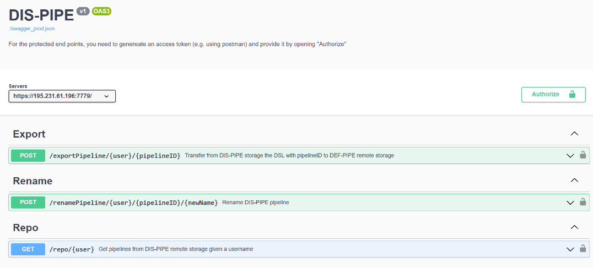

Deployment, Code and Documentation Availability
------------

Concerning DIS-PIPE code and documentation, the tool is available on GitHub at the following link: https://github.com/DataCloud-project/DIS-PIPE

DIS-PIPE is deployed on a single host accessible from the browser at following link: https://195.231.61.196:7778/ (or at https://datacloud-dis.euprojects.net/). The user’s browser first triggers an incoming request. Afterward, the backend of the tool, which is in charge to load the GUI and allow users to interact with its provided functionalities, manages and processes the user’s request.

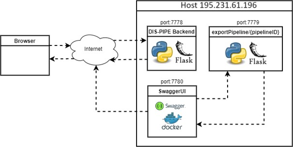
==========
Pipeline Definition
==========

DEF-PIPE provides a visual design for domain experts to implement Big Data pipelines based on a DSL, including means to store and load the pipeline definitions. Furthermore, it enables data scientists to define the pipelines by configuring each step, injecting code, or customising predefined generic templates.

The DEF-PIPE Frontend is a graphic pipeline designer tool for defining Big Data pipelines and transforming them to DSL. The main part of the application is the interface for designing big data pipelines. This interface is implemented as a single page application using ReactJS. The popularity and stability of ReactJS make it potentially more friendly with developers to continue with the project later on. The project also uses Bootstrap, a CSS-framework providing basic UI-components building blocks, which are easy to customize.

The backend is implemented in C# using the DotNet (.NET) framework from Microsoft. In particular, ASP.NET Core, which is the part of the NET framework for web application, is being used. It implements a web API providing a central interface for operations such as managing pipelines and templates data, transforming pipelines into DSL.

Database of Pipeline Designer is used to model the steps and workflow of the pipeline. The model is persisted in JSON-format, and persisted in a MongoDB database. DEF-PIPE is integrated with Keycloak as single sign-on (SSO) solution. It offers user asset management for steps and pipelines, including the ability to expose them to other users publicly. The frontend includes improved support for parametrization of steps.

Integration with the Toolbox Components
------------
Integration with other DataCloud components is done via implementing APIs. The APIs allow a DSL description of a discovered pipeline by the DIS-PIPE tool to be presented and edited in the graphical DEF-PIPE tool. DEP-PIPE and SIM-PIPE tools are already integrated and using the provided API to retrieve, edit, and delete a pipeline. 

The API functionality within DEF-PIPE has been further improved. While the initial implementation allowed DSL descriptions to be retrieved based on the pipeline name, we have now enhanced this feature. The updated API now utilizes the pipeline's unique ID to fetch the DSL definition, ensuring a more precise and efficient retrieval process.

The adjusted export pipeline in the DSL-API documentation can be seen below. As illustrated, the API takes the user and the pipeline’s unique id to return the DSL definition of pipeline.

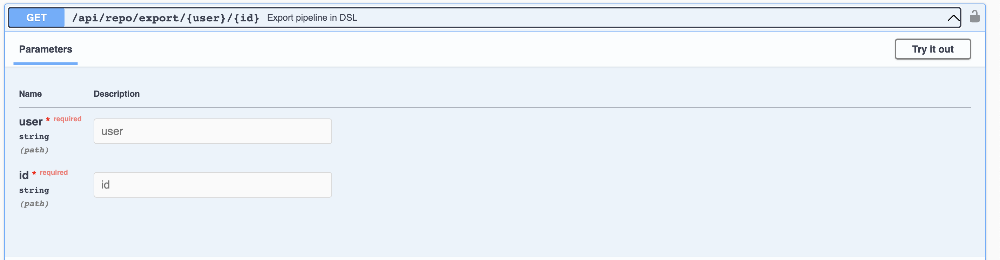

Additionally, we announced the implementation of an API allowing users to retrieve their pipelines' YAML file definitions. This feature complements the existing capabilities of DEF-PIPE, enabling users to access both DSL description and YAML file with ease.
DEF-PIPE APIs are described at: https://crowdserv.sys.kth.se/docs

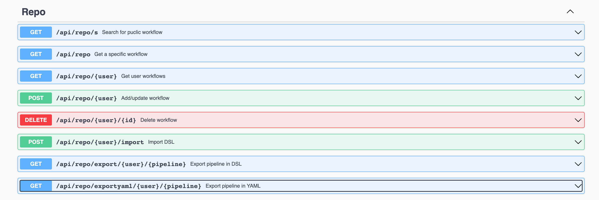

Deployment, Code and Documentation Availability
------------

DEF-PIPE is available on GitHub, along with dedicated instructions for usage https://github.com/DataCloud-project/DEF-PIPE-Frontend

The DEF-PIPE graphical tool is also deployed at https://crowdserv.sys.kth.se

==========
Pipeline Simulation
==========

SIM-PIPE simulates the pipeline execution and provides final deployment configurations that conform to the hardware requirements. SIM-PIPE also provides testing functionalities, such as a sandbox for evaluating the performance of individual pipeline steps and statistical analysis of the overall pipeline performance.

SIM-PIPE takes a pipeline's definition as input and outputs runtime metrics, such as CPU usage, memory usage, energy consumption, run durations, and network bandwidth. SIM-PIPE can perform dry runs of pipelines by running small and brief versions of the pipelines in a sandbox. These dry runs improve the simulations' accuracy for deployments at larger scales and assert whether one pipeline executes successfully.

Integration with the Toolbox Components
------------

SIM-PIPE provides a GraphQL API. GraphQL is a query language for APIs and a runtime for fulfilling those queries with your existing data. GraphQL provides a complete and understandable description of the data in your API, allows the clients to ask for exactly what they need, makes it easier to evolve APIs over time, and enables powerful developer tools. 
In addition to the integration with DEF-PIPE, SIM-PIPE dry run data is used by the scheduler of ADA-PIPE. The integration of ADA-PIPE and SIM-PIPE to enhance data pipeline scheduling is shown below.

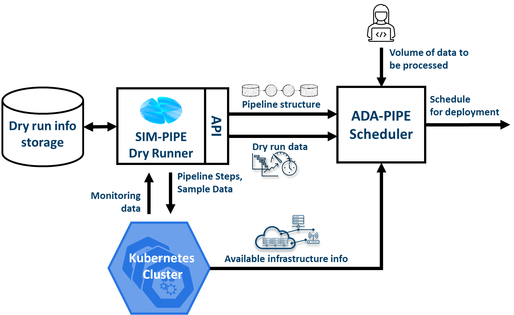

Deployment, Code and Documentation Availability
------------

The SIM-PIPE source code is available in a single GitHub repository: https://github.com/DataCloud-project/SIM-PIPE 

It is released as open-source software under the Apache License 2.0.

The SIM-PIPE technical documentation, architecture description, deployment and installation guides, and user guides with examples, and contributing guide are also available in the GitHub repository. SIM-PIPE is used as a self-installed tool, that users can use. A public deployment is currently included as part of the DataCloud demo server (datacloud-toolbox.euprojects.net).

The API documentation is stored in the Git repository in HTML format is available at https://htmlpreview.github.io/?https://github.com/DataCloud-project/SIM-PIPE/blob/main/controller/public/index.html 

Developers experienced with GraphQL can discover the API using any GraphQL tool, such as `GraphiQL <https://github.com/graphql/graphiql>`_ or `Insomnia <https://insomnia.rest>`_.

==========
Pipeline Scheduling and Adaptation
==========

ADA-PIPE provides a data-aware algorithm for optimised and adaptable scheduling on the Computing Continuum with infrastructure drift adaptation capability. ADA-PIPE allows to reconfigure the resource allocation to pipeline steps to fulfil the service level agreement between user’s and the resource providers. 

Integration with the Toolbox Components
------------

ADA-PIPE tool is running on a European Exoscale Cloud virtual machine accessible at the following IP address and domain name: http://194.182.187.139/ and https://datacloud-ada.euprojects.net/

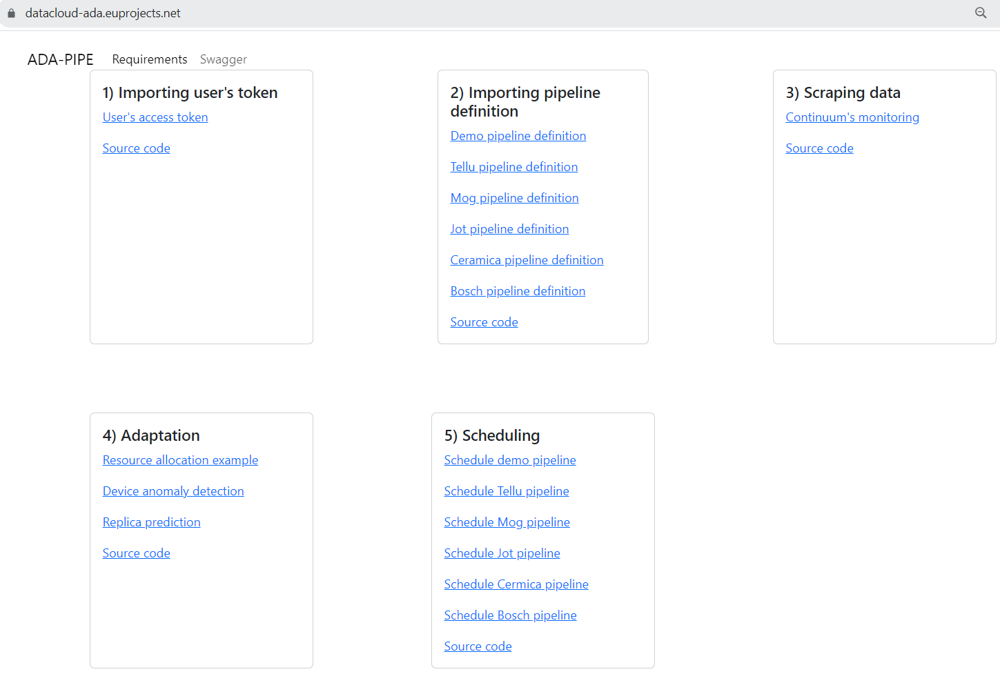

Swagger UI and the API can be found in the following URL: http://194.182.187.13/swagger/ 

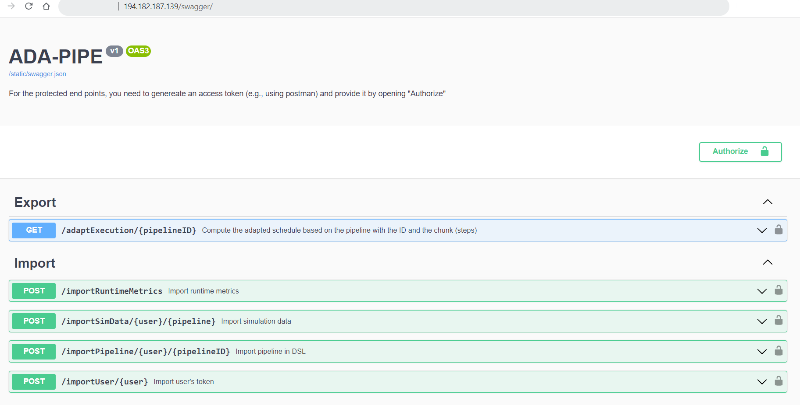

Here shows that ADA-PIPE is able to receive the DSL definition of the user’s pipeline defined in DEF-PIPE tool. This information includes the quantitative hardware requirements for the pipeline steps that helps ADA-PIPE to match the pipeline’s steps to the devices with sufficient resources.

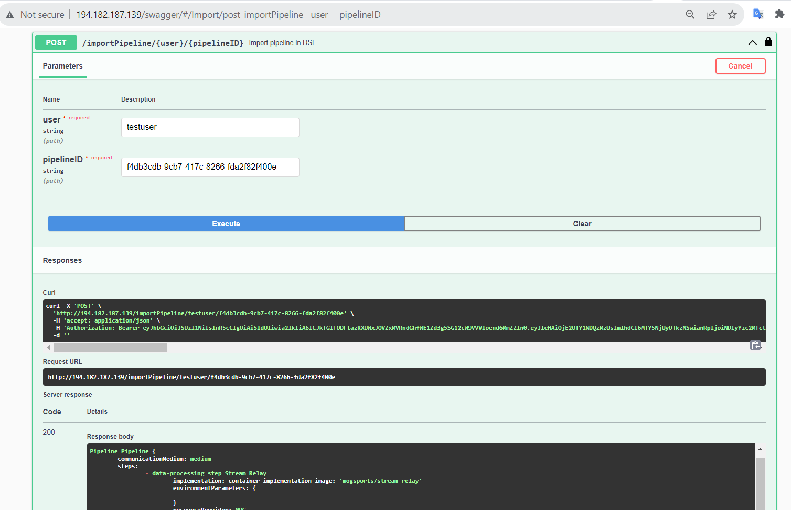

Following receipt of the pipeline requirements, ADA-PIPE computes schedules based on device anomalies or the resource consumption of pipeline steps, and then modifies the pipeline's execution on computing devices. Next, using the ``adaptExecution`` API, it exports the schedules to DEP-PIPE for deployment (see next image). The pipeline ID, which is obtained from the DEF-PIPE toolbox, is the primary argument supplied to the ``adaptExecution`` API.

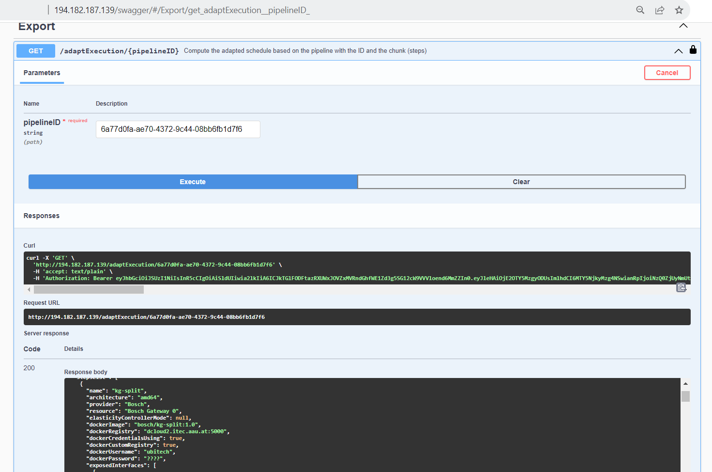

Deployment, Code and Documentation Availability
==========

Mainly, the source codes for the ADA-PIPE tool are available in the repository of https://github.com/DataCloud-project/ADA-PIPE. It is categorized based on the integrated C3 testbed into the DataCloud infrastructure, anomaly detection, frontend, matching-based scheduler, resource utilization and pipeline step’s replica predictions, and deployment’s update source codes available.

Specifically, the frontend source code is available in the repository https://github.com/DataCloud-project/ADA-PIPE/tree/main/frontend/.
ADA-PIPE used the Bootstrap features by following a `video tutorial <https://www.youtube.com/watch?v=kMsKm53XtyA>`_ and a `document on creating a simple web page using Bootstrap <https://www.blog.duomly.com/how-to-crate-simple-web-page-using-bootstrap-5/>`_.
In addition, the tutorial on how to redirect the traffic from the default flask port number (i.e., 5000) to the http port number (i.e., 80) is provided. ADA-PIPE utilizes the Python flask microweb framework to provide the functionalities of the tool. This web page provides the documentation for the tool and allows the integrated DataCloud toolbox to communicate through the APIs such as ``importPipeline`` and ``adaptExecution``. 

ADA-PIPE receives and authorizes the user’s token, imports the domain-specific language-based model of the user’s pipeline through its ID, utilizes subprocess and JSON Python libraries, and then parses these descriptions to extract the requirements.

In addition, ADA-PIPE calculates the device anomalies based on the history data imported from the DEP-PIPE monitoring tool. Specifically, the anomaly detection component utilized the Netdata metrics collected through the Prometheus monitoring system accessible through the DEP-PIPE tool. Thereafter, ADA-PIPE utilizes the collected data of the running pipeline steps on the computing infrastructure to estimate and predict the number of replicas required by the pipeline steps by using a machine learning model (see details regarding the `prediction model <https://github.com/DataCloud-project/ADA-PIPE/tree/main/replica-prediction>`_).

Afterward, ADA-PIPE provides a capacity-aware matching-based scheduler for data pipeline execution on the computing continuum. The base model of the matching-based scheduler requires the Python libraries: matching, networkx, operator, numpy, yaml, json.

ADA-PIPE currently supports to provide either the cost-optimized or time-optimized schedules. Therefore, it first analyses the requirements of each specific step. These includes processing speed, memory, storage sizes, the capabilities of the target deployment infrastructure, and the available resources in R-MARKET. Moreover, it receives the pipeline simulation from the SIM-PIPE tool, which provides the execution time along with the resource utilization of the pipeline’s execution on the computing infrastructure. Finally, ADA-PIPE relies on the Cloud virtual machine prices to estimate the user’s costs. Based on this analysis, ADA-PIPE creates an initial deployable schedule, which minimizes resource cost or time of execution of the pipeline

After analyzing the updates on the resource requirements of the pipeline steps, the integrated component adapts the pipeline execution. Hence, ADA-PIPE first pre-checks the updates through the horizontal pod scaling functionalities of Kubernetes. Its source code is available in the DataCloud public code repository. Thereafter, ADA-PIPE exports the required number of replicas of the executed pipeline steps through the scaling APIs of the DEP-PIPE.

Decentralized Resource Marketplace (R-MARKET)
==========

R-MARKET deploys a decentralised hybrid permissioned and permissionless blockchain network that federates a vast set of heterogeneous resources from various providers across the Computing Continuum. R-MARKET creates a democratic marketplace of trustworthy resources and enables transparent provisioning over multiple control and network domains for external use.

Integration with the Toolbox Components
------------

R-MARKET is a composite tool, developed by getting the inspiration from the `iExec Marketplace <https://https://market.iex.ec/>`_.All the related component of the R-MARKET are listed and available to the GitHub repository (https://github.com/DataCloud-project/R-MARKET). The main entry point of the R-MARKET tool is the R-MARKET UI (https://github.com/DataCloud-project/R_MARKET_UI), which is a React.JS UI (Figure 28 and Figure 29) and it helps ease the interaction between other tools and R-MARKET component by hiding the complexity of Blockchain technology. This UI is deployed on the Microsoft Azure provisioned VM and available at: https://r-market.westeurope.cloudapp.azure.com:5555/.

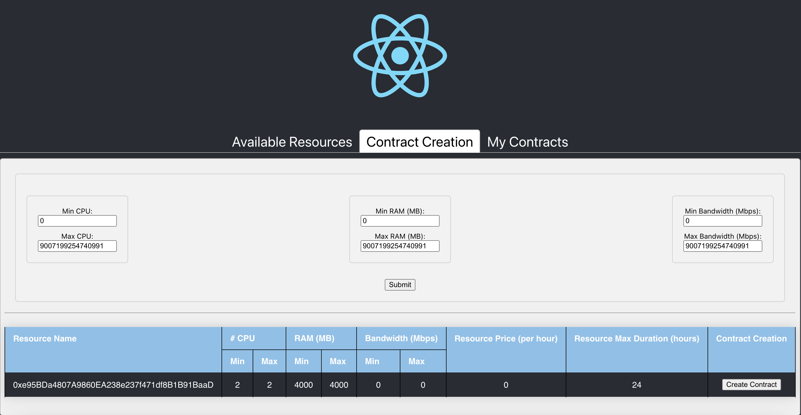

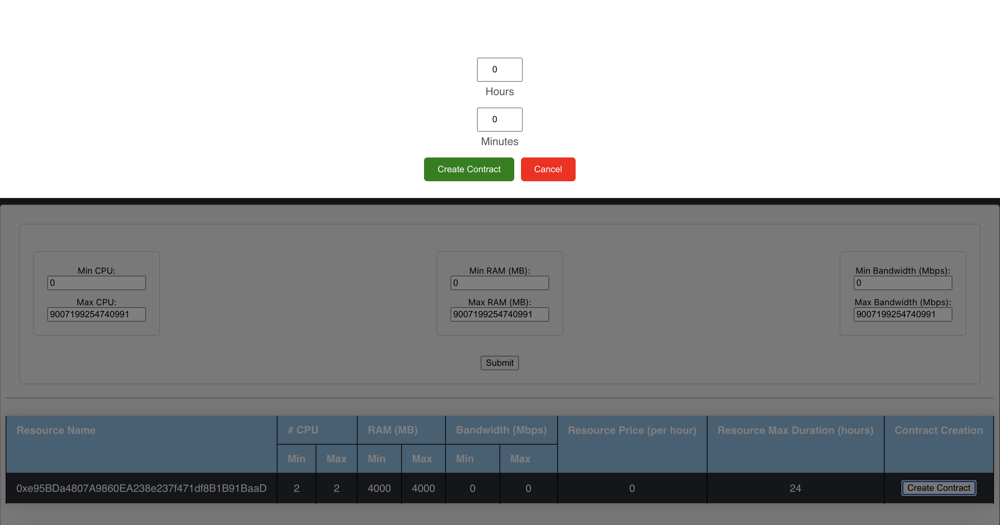

For authenticating the R-MARKET UI interactions, the MetaMask plugin is used and its integration is with the R-MARKET Node.JS API server and the R-MARKET back-end.

The R-MARKET API stands as the central communication hub within the R-MARKET ecosystem, serving as the conduit through which a wide array of functions and operations are executed. Its pivotal role lies in empowering the R-MARKET UI by granting it the capability to access, interact with, and oversee the functionalities of the decentralized marketplace. The synergy between the R-MARKET API and R-MARKET UI is mutually beneficial, with the API being responsible for executing the commands and actions initiated by users through the user interface. It operates as the responsive server that handles specific functions for the R-MARKET UI, effectively coordinating tasks such as resource provisioning, reservation, and transaction with precision and efficiency. R-MARKET API serves as a vital link, connecting users to the MetaMask decentralized marketplace. It ensures that users' requests and commands seamlessly translate into actionable operations, ultimately fostering a marketplace experience that is both user-friendly and highly efficient.

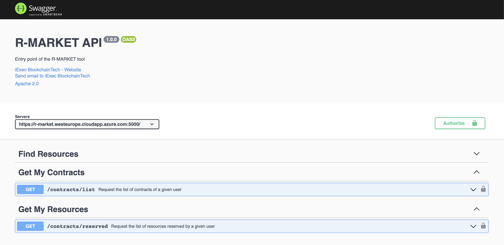

Besides the R-MARKET UI and API, we have already deployed the All-in-One Blockchain node over the Microsoft Azure provisioned VM, for permanently keeping the deal information and transactions into the Blockchain. In addition, we have already deployed a workerpool, along with scheduler and workers, over a Microsoft Azure provisioned VM. The details of this workerpool are available to the following link: Workerpool 1: http://r-market.westeurope.cloudapp.azure.com:30000/

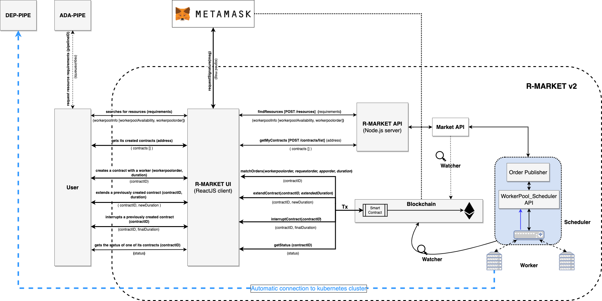

ADA-PIPE, DEP-PIPE and R-MARKET collectively constitute the Run-Time bundle. This bundle serves as the foundation for scheduling and provisioning Computing Continuum resources to facilitate the deployment of Big Data pipelines.

A visual depiction of these components' integration into the run-time bundle can be seen above. This integration modification improves resource allocation, guaranteeing a more effective Big Data pipeline deployment procedure.

The user interfaces for the R-MARKET UI are depicted in the schema below.

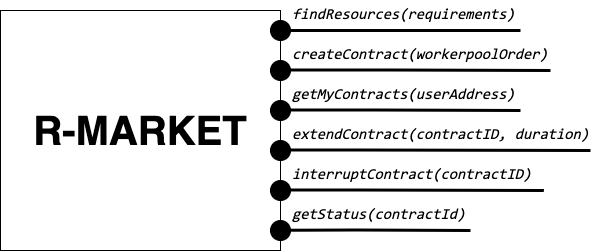

Deployment, Code and Documentation Availability
------------

In the main GitHub repository of the R-MARKET (https://github.com/DataCloud-project/R-MARKET), all the corresponding repositories for R-MARKET tool has been documented. Notably, R-MARKET has seven different repositories for the various R-MARKET components (e.g., UI, Node.JS Server, Market-API, Scheduler, Worker, etc.) followed by one repository for R-MARKET SDK. The source code and user-instruction/guidelines for each individual tool can be found in the corresponding repository.

For showcasing the workerpool details, the dashboard for workerpool is accessible to the following link: http://r-market.westeurope.cloudapp.azure.com:30000/.

An overview of the current testbed, where we have implemented the R-MARKET components, is given in this schema. The Microsoft Azure platform serves as the host for this testbed. We have implemented a single workerpool in this setup, which is managed by a scheduler. We currently have our configuration maintaining a primary workerpool with at least three workers that are always connected. Furthermore, we have worker nodes that have been provided by our partners and are periodically available for task execution. We intend to extend the testbed further as part of our ongoing expansion efforts by deploying more workerpools that will integrate a wider range of resources from our partner organizations.

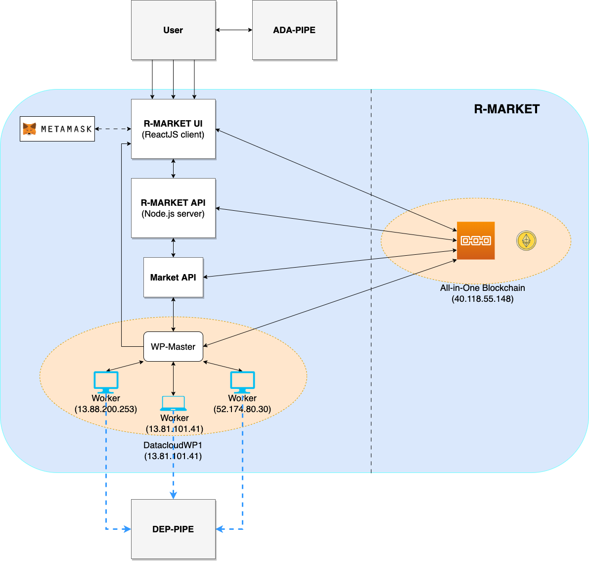

==========
Pipeline Deployment & Management
==========

DEP-PIPE enables flexible and scalable deployment and orchestration of Big Data pipelines over the Computing Continuum resources. DEP-PIPE monitors the pipeline execution and provides online SLO metrics to the other tools.

Integration with the Toolbox Components
------------

To perform deployment in DEP-PIPE, DEF-PIPE provides a list of pipelines per user. Once the user selects the pipeline, ADA-PIPE provides DEP-PIPE with the pipeline chunk to deploy, and a description of the resources allocated to it.
On the image below can be seen how ADA-PIPE integrates with DEP-PIPE with the API.

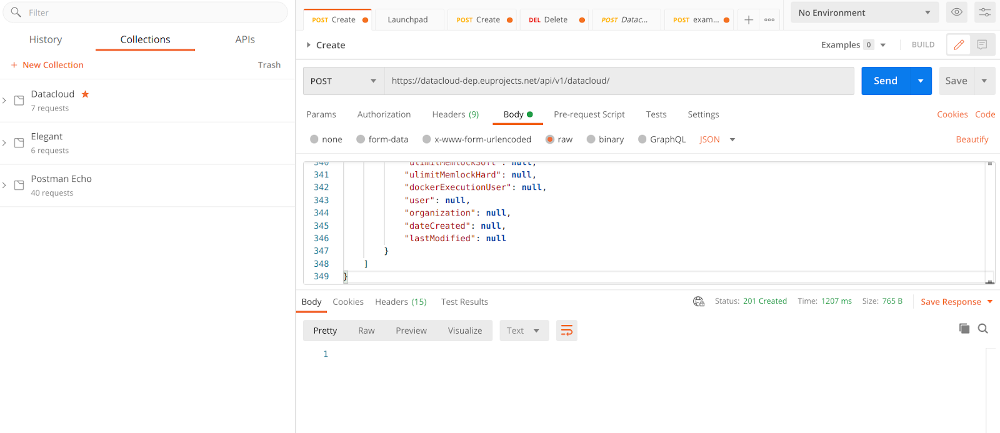

The JSON for this call is provided below, and based on the Json schema of the `DEP-PIPE <https://github.com/DataCloud-project/DEP-PIPE-Pipeline-Deployment-Controller/blob/main/samples/sample-file.json>`_ descriptor

..  code-block:: JSON

   {
    "pipelineName": "Heathcare_pipeline",
    "pipelineType": "simulation|production",
    "stepName": "readMedicValues",
    "terminationCheck": {
        "httpURL": "localhost/api/v1/success"
    },
    "time": {
        "EST": 0.0,
        "EFT": 2.92
    },
    "jobListjob": [{
        "order": 1,
        "name": "readMedicValues",
        "resource": "datacloud_worker_1_wp1",
        "provider":"R-MARKET",
        "architecture": "amd64",
        "elasticityControllerMode": "HORIZONTAL",
        "dockerImage": "xx/xxx:1.0",
        "dockerCredentialsUsing": "false",
        "dockerUsername": "",
        "dockerPassword": "",
        "dockerCustomRegistry": "true",
        "dockerRegistry": "",
        "requirement": {
            "vCPUs": 4,
            "ram": 4,
            "storage": 20
        },
        "healthCheck": {
            "httpURL": "localhost/api/v1/healthCheck",
            "args": "ps -e | grep java",
            "interval": 20
        },
        "terminationCheck": {
            "httpURL": "localhost/api/v1/success",
            "args": "ps -e | grep java"
        },
        "command": "-->Container Excecution<--",
        "environmentalVariables": [{
            "key": "",
            "value": ""
        }],
        "numWorkers": 5,
        "exposedInterfaces": [{
            "name": "sparkMasterRest",
            "port": "8000",
            "interfaceType": "Core",
            "transmissionProtocol": "TCP"
        }],
        "requiredInterfaces": [{
            "friendlyNamename": "sparkMasterRest"
        }],
        "plugin": [{
            "name": ""
        }],
        "devices": [{
            "key": "/dev/gpu0",
            "value": "/dev/gpu0"
        }],
        "volumes": "!!!pending!!!",
        "labels": [{
            "name": ""
        }],
        "hostname": "-->Advanced Options<--",
        "capabilityDrops": [{
            "name": ""
        }],
        "capabilityAdds": [{
            "name": ""
        }],
        "ulimitMemlockSoft": "",
        "ulimitMemlockHard"f: "",
        "networkModeHost": "true",
        "privilege": "false",
        "publicComponet": true,
        "dockerExecutionUser":""
        }]
    }

Deployment, Code and Documentation Availability
------------

DEP-PIPE is currently split in four different repositories that are available in GitHub, and also uses MAESTRO that is hosted in UBITECH’s private registry.

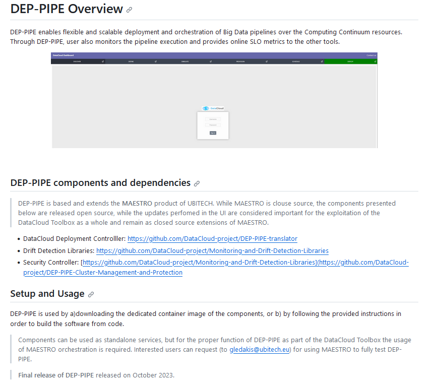
    

The main repository contains instructions for the DEP-PIPE setup (including MAESTRO tool setup instructions) in the main repository. 

The DataCloud Deployment controller provides the main functionalities that allow the deployment of DataCloud pipelines, by transforming the ADA-PIPE provided JSON and create the needed steps (creation of dedicated containerized services) for the deployment through DataCloud. DataCloud Security Controller provides the backend services for the security functionalities (vulnerabilities scanning, access control). Finally, the monitoring service (that consists of a Monitoring collector, Prometheus and a service providing REST API) and data-drift libraries are provide in the dedicated repo.
DEP-PIPE has been deployed online and is accessible through the https://datacloud-dep.euprojects.net domain and is also part of the toolbox demo page (https://datacloud-toolbox.euprojects.net/#/deploy).

